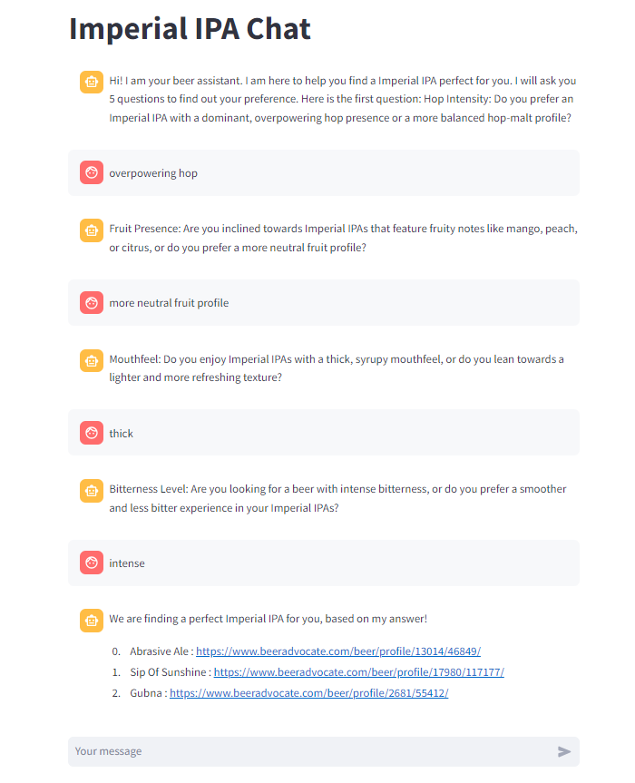

Hi U-Glow Team! Welcome to this simple Beer Recommendation Chatbot 😀

Purpose:  
  * Developed a chatbot as a showcase of coding proficiency

Data Collection:  
  Scraped data from a beer forum, focusing on Imperial IPA discussions

Text Embedding:  
  Applied Sentence2Vec using Hugging Face Transformer ('sentence-transformers/all-MiniLM-L12-v2') to analyze comments

Part of Speech (POS) Tagging:  
  Extracted adjectives from each comment for further analysis

User Interaction:  
  Leveraged ChatGPT 3.5 to generate insightful questions (5) based on the POS tagging aimed at understanding users' beer preferences

Preference Analysis:  
  Calculated Comment Similarity using Matrix Multiplication to identify the top 3 most similar Imperial IPAs from the database

To find your perfect match: Please clone this repository and then run "streamlit run st_chatbot_stcode.py" in terminal

If you have any enquiries, please feel free to let me know!  
Enjoy! 😚
